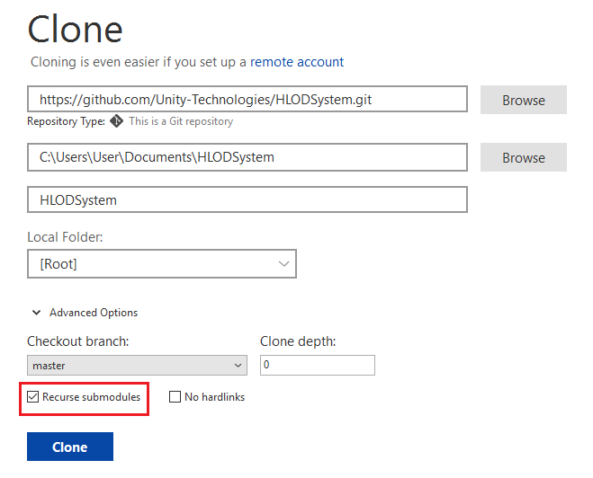
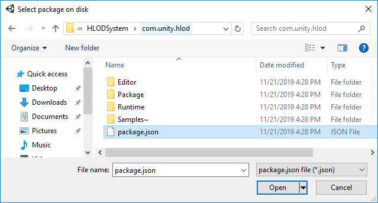

# Getting started

## Prerequisites
-   Git Client
-   Unity 2019.3+ (2019.2 works too, but 2019.3+ is recommended)
-   Unity Technologies GitHub Account

## Getting HLOD System
HLOD System is provided as an individual package. Currently it is available only on GitHub. In later stages of development, it will be available through Unity Package Manager.

HLOD System GitHub Repo URL is [https://github.com/Unity-Technologies/HLODSystem](https://github.com/Unity-Technologies/HLODSystem)

Follow through to get the package to your local PC and work with it.

### CLI

**Step 1.** Run one of the following commands to clone the repo:

`git clone https://github.com/Unity-Technologies/HLODSystem.git`

or

`git clone git@github.com:Unity-Technologies/HLODSystem.git`


```
user@DESKTOP /Dev$ git clone https://github.com/Unity-Technologies/HLODSystem.git
Cloning into 'HLODSystem'...
remote: Enumerating objects: 150, done.
remote: Counting objects: 100% (150/150), done.
remote: Compressing objects: 100% (110/110), done.
remote: Total 4179 (delta 76), reused 80 (delta 39), pack-reused 4029
Receiving objects: 100% (4179/4179), 139.22 MiB | 16.71 MiB/s, done.
Resolving deltas: 100% (2684/2684), done.
user@DESKTOP /MobileOpenWorldSample
```

**Step 2.** Next, change directory to the root directory of HLOD, and pull the dependencies, which are included into project as Git Submodules. They are [ConditionalCompilationUtility](https://github.com/Unity-Technologies/ConditionalCompilationUtility) and [UnityMeshSimplifier](https://github.com/Unity-Technologies/UnityMeshSimplifier):

`cd HLODSystem`

`git submodule update --init --recursive`

```
user@DESKTOP Dev$ cd HLODSystem
user@DESKTOP Dev/HLODSystem$ git submodule update --init --recursive
Submodule 'com.unity.hlod/Package/ConditionalCompilationUtility'
(https://github.com/Unity-Technologies/ConditionalCompilationUtility.git) registered for path                                                  |
'com.unity.hlod/Package/ConditionalCompilationUtility'
...
user@DESKTOP /MobileOpenWorldSample
```

### Sourcetree

For this particular example, we used [Sourcetree](https://www.sourcetreeapp.com/), but the steps should be fairly similar for the GUI Client of your choice.

**Step 1.** Open Sourcetree, and click Clone Button:


**Step 2.** Input the clone URL, select the destination where the repo is cloned, and wait for a couple of seconds until Sourcetree gets the repo details:

`https://github.com/Unity-Technologies/HLODSystem.git`

or

`git@github.com:Unity-Technologies/HLODSystem.git`

**Step 3.** Make sure to check Recurse submodules checkbox and click Clone:



## Importing package to a Unity Project

**Step 1.** Open the Unity Project which you want to add HLOD to, and open the Package Manager Window.

**Step 2.** Click the + button on the top-left corner, and select Add package from disk... menu:


**Step 3.** Browse to the location where you cloned HLODSystem repo, open com.unity.hlod folder and select package.json file. Click Open. 



The Editor will import and add HLOD System to the project. Now the project is ready to use it.

